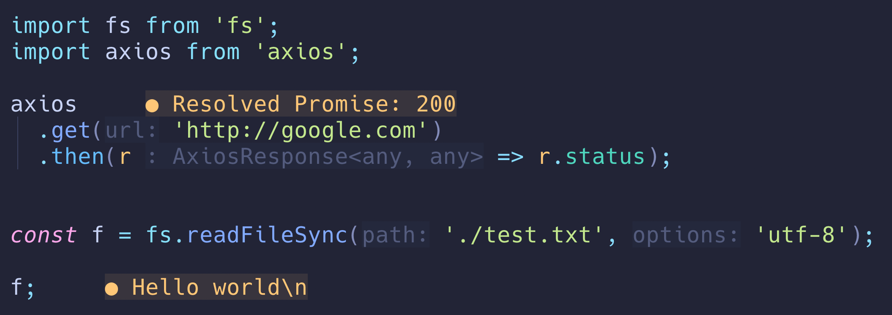

<h1 align="center">Tsw - Live Results In Neovim</h1>
<h3 align="center">A plugin to show the result of your TypeScript or JavaScript code right beside your code in your neovim editor.</h3>

<div align="center">

</div>


## Installation
Copy the `ts-worksheet.lua` and the `ts-worksheet-cli.js` files into the location your nvim installation looks up plugins. It's only important that both files are in the same directory.
If you want to use `bun` or `deno` to run your code, the binaries have to be available from a terminal. (Check with `which bun` or or `which deno` if they are available)

## Setup
You don't need any setup to start using it. So just require it:
```lua
require('ts-worksheet')
```

If you want to change the diagnostics color of the output, you can use a setup like this:
```lua
require('ts-worksheet').setup({
    type = vim.diagnostic.severity.WARN
})
```

## How To Use Other Runtimes
Just make sure to have `bun` or `deno` available in your systems `PATH`.

## Usage
Just call `:Tsw` in a `js` or `ts` file to run the worksheet. 
By default it uses `node` as runtime and does not show the results of variables.

### All options
`Tsw rt=[bun|node|deno] show_variables=[true|false] show_order=[true|false]`

### Defaults:
`Tsw rt=node show_variables=false show_order=false`
